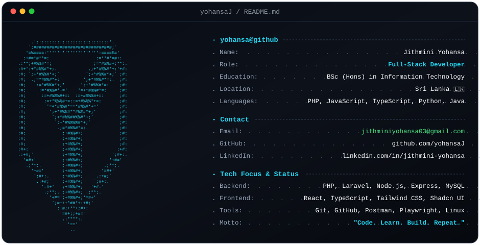

  <h1>👩‍💻 Jithmini Yohansa</h1>
  <h3>🚀 Full-Stack Developer | Sri Lanka 🇱🇰</h3>

  

    
  

---

  

  &nbsp;
  &nbsp;
  &nbsp;
  &nbsp;
  

---

## 👩‍💻 About Me

- 🎓 Pursuing **BSc (Hons) in Information Technology**
- 💼 Former **Software Engineering Intern** at Faculty of Engineering, University of Ruhuna
- 💡 Passionate about building responsive, robust, and user-centric web applications
- 🌱 Exploring modern cloud architecture, scalable microservices, and design systems
- ⚡ In my free time, I love exploring emerging technologies, automated testing, and web UI trends
- 📫 Let's connect: **[LinkedIn](https://www.linkedin.com/in/jithmini-yohansa)** or email me at **[jithminiyohansa03@gmail.com](mailto:jithminiyohansa03@gmail.com)**

---

## 🛠️ Tech Stack & Skills

  

<b>🔍 Detailed Skills Breakdown</b>

 

| Category | Technologies |
|---|---|
| **Languages** | PHP, JavaScript (ES6+), TypeScript, Python, Java, C, C++, HTML5, CSS3 |
| **Frontend Frameworks & UI** | React.js, Tailwind CSS, Shadcn UI, Chakra UI, Redux Toolkit, Framer Motion |
| **Backend & Databases** | Laravel, Node.js, Express.js, MySQL, MongoDB, RESTful APIs |
| **Testing, Tools & Platforms** | Playwright, Git, GitHub, Postman, Linux, VS Code |

---

## 💼 Experience

#### 🏛️ Software Engineering Intern — Faculty of Engineering, University of Ruhuna
- Contributed to the development and enhancement of the institution's core **Management Information System (MIS)**.
- Engineered resilient backend APIs and relational database logic using **PHP / Laravel** and **MySQL**.
- Implemented modern, accessible frontend modules utilizing **React**, **TypeScript**, **Tailwind CSS**, and **Shadcn UI**.

---

## 🚀 Public Repositories & Featured Projects

| Project | Description | Tech Stack | Repository |
|---|---|---|:---:|
| 🌐 **Personal Portfolio** | Modern responsive developer portfolio showcasing skills, projects, and contact info. | `HTML5` `CSS3` `JavaScript` | [🔗 View Repo](https://github.com/yohansaJ/yohansaj.github.io) • [🌐 Live Demo](https://yohansaj.github.io) |
| ⚛️ **Dataverse (Web Project)** | Comprehensive analytics and management platform with charts, maps, and PDF export. | `React` `Redux` `Tailwind` `ChakraUI` | [🔗 View Repo](https://github.com/yohansaJ/web-project) |
| 🎓 **UniStudy-Hub** | Centralized university management system streamlining student and academic collaboration. | `Java` `React` `MongoDB` | [🔗 View Repo](https://github.com/Awantha2003/UniStudy-Hub_ITPM) |
| 🏫 **Smart Campus System** | Collaborative PAF group project integrating smart campus services and academic workflows. | `JavaScript` `React` `Node.js` | [🔗 View Repo](https://github.com/Awantha2003/it3030-paf-2026-smart-campus-group) |
| 💬 **Quotes Generator** | Interactive web application generating daily curated quotes with modern aesthetics. | `HTML5` `CSS3` `JavaScript` | [🔗 View Repo](https://github.com/yohansaJ/Quotes-generator) |
| 🐍 **Playwright Automation (Python)** | Test automation framework for system workflow validation using Playwright in Python. | `Python` `Playwright` | [🔗 View Repo](https://github.com/yohansaJ/ITPM-playwright-assignment) |

---

## 📊 GitHub Statistics

  
  

  

---

## 🏆 GitHub Achievements

  

---

  
📫 Open to internships, junior roles, and exciting collaborations!

  <b>✨ "Code. Learn. Build. Repeat." ✨</b>

